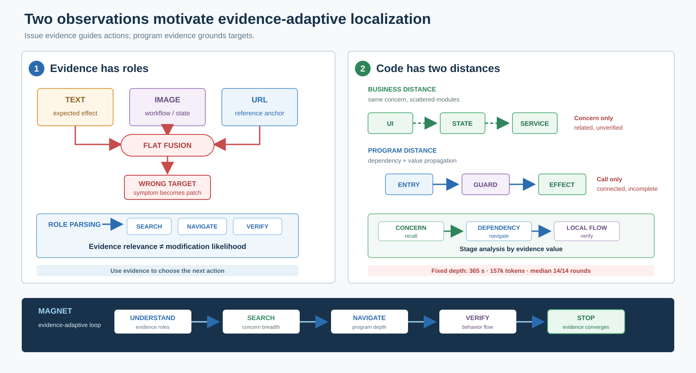

# MAGNET 论文动机（中文初稿）

## 研究动机

仓库级 Issue 定位旨在根据用户报告识别最可能需要修改的文件、模块和函数，是自动问题修复之前的关键步骤。现有方法通常沿两条路线缩小搜索空间：一类从 Issue 中显式出现的文件或符号出发，逐层筛选候选；另一类让智能体借助检索工具或代码图在仓库中迭代探索。前者容易把外部症状误当作根因并过早收窄范围，后者虽然扩大了召回，却可能在整个仓库中累积无关上下文和错误搜索方向。CoSIL 将这一矛盾概括为搜索广度、分析深度与方向控制之间的失衡，并以先文件后函数的动态图搜索缓解该问题 \cite{jiang2025cosil}；LocAgent、RepoGraph 和 OrcaLoca 也分别表明，显式程序结构、优先级调度和上下文剪枝能够改善仓库导航 \cite{chen2025locagent,ouyang2025repograph,yu2025orcaloca}。然而，在真实多模态 Issue 中，搜索起点本身未必可靠，而“结构上可达”也不等于“行为上应修改”。

这一困难在视觉软件问题中更加突出。SWE-bench Multimodal 的人工标注显示，83.5% 的含图任务被认为无法脱离图像有效解决，但截图、代码图、错误信息和期望输出提供的是不同类型的线索 \cite{yang2025swebenchmm}。同样，代码 URL 可能指向复现入口、调用者或可复用 API，而不是补丁位置。若将文本、图像和 URL 无差别压缩成一个查询，最显著的 UI 文本或精确符号往往会占据高位，后续搜索则围绕这一“现象位置”持续展开。因此，异构证据带来的核心问题并不是信息不足，而是**证据相关性与修改可能性并不等价**。

**观察一：Issue 证据首先应决定搜索动作，而不是直接决定修改目标。** 文本通常描述预期效果或约束，图像呈现工作流与可观察状态，URL 和符号则更适合作为导航锚点。定位系统应显式区分这些证据角色：有的证据提高候选的修改先验，有的触发 caller、used-by 或同类实现搜索，还有的只用于核验候选能否解释问题。只有当代码内容或程序关系将某个证据与预期行为连接起来时，该证据指向的位置才应被提升为补丁候选。换言之，Issue 理解的产物不应只是更多关键词，而应是一组可约束后续工具选择和搜索方向的证据角色。

即使获得正确入口，Issue 语义与程序行为之间仍存在第二个距离。本文沿用 RepoLens 的定义，将 **concern** 视为共同实现某一业务概念或用户可观察责任的一组语义内聚功能 \cite{wang2025repolens}。同一 concern 可能埋在包含多种职责的大函数中，即 concern tangling；也可能分散在页面、状态管理和服务层，即 concern scattering。这些位置在业务上相关，却不一定形成连续调用链。反过来，import、call 和 used-by 边能够揭示结构依赖，却可能将搜索带向与当前 Issue 无关的公共节点。更重要的是，文件、类和函数级结构图只能说明实体如何连接，不能直接说明某个状态值如何被定义、传播并最终影响故障行为。ARISE 进一步表明，按需 definition-use slicing 能为函数级和语句级定位提供结构图所缺少的行为证据 \cite{seddik2026arise}。

**观察二：高召回的业务搜索与高精度的行为验证必须分层执行，并由证据动态分配预算。** 横向 concern 搜索回答“哪些代码共同承担该业务责任”，用于越过不连续的模块边界；纵向依赖导航回答“入口与实现之间如何连接”，用于沿真实程序关系深入；局部数据流验证回答“关键状态是否经过候选代码并影响预期效果”，用于排除仅在词义或结构上相关的节点。三者不能互相替代，也不应在全仓库上以同等成本执行：先以低成本语义与结构信号扩大召回，再只对高价值候选开展源码阅读和流验证，才能同时控制漏检与噪声。

固定深度的智能体搜索会放大这一成本矛盾。在本文 92 个样本的开发配置中，每个样本平均耗时约 365 秒、累计消耗约 15.7 万个模型调用 token，动态搜索轮数的中位数达到预设上限 14。该结果不是跨系统效率比较，而是一个过程诊断：当每个实例都运行到近似相同的最大深度时，增加轮数并不保证获得新证据，早期误判反而会通过历史上下文继续传播。因此，搜索过程还必须根据证据缺口、候选稳定性和新增信息决定何时横向扩展、何时纵向深入、何时调用流分析，以及何时停止或恢复到证据质量更高的早期状态。

**图 1. MAGNET 的两个核心动机。** 左侧说明异构证据具有不同功能角色，相关证据不能直接等同于修改目标；右侧说明业务 concern、程序依赖与数据流分别提供召回、导航和行为核验，固定深度搜索难以同时控制漏检、噪声与成本。底部给出由此导出的证据自适应定位过程。

上述两个观察共同导出本文的设计原则：先将多模态 Issue 转换为带角色的工作流、concern、状态和预期效果，再让智能体在横向 concern 搜索与纵向依赖导航之间动态切换，并仅对收缩后的候选执行流感知验证。基于这一原则，本文提出 MAGNET，一种证据驱动的动态代码定位框架。MAGNET 不以无限扩大上下文换取召回，而是在有限时间和 token 预算内逐步积累可核验证据，最终输出文件、模块和函数三级定位结果。

---

## 作者校验注（投稿时删除）

- CoSIL 已被 ASE 2025 接收；其论文明确讨论了过窄与过宽搜索、错误方向传播和迭代剪枝。本文借鉴其“挑战—观察—设计”论证方式，不声称复现其两阶段调用图算法。
- LocAgent 为 ACL 2025 正式论文；RepoGraph 为 ICLR 2025 工作；OrcaLoca 为 ICML 2025 正式论文。
- SWE-bench Multimodal 为 ICLR 2025 工作；“83.5%”来自作者对 557 个含图实例的人工必要性判断。
- concern、concern tangling 和 concern scattering 的直接来源是 RepoLens，而不是 ARISE。RepoLens 当前为 arXiv 预印本，正文引用时不应将其表述为已录用顶会论文。
- ARISE 当前为 arXiv 预印本。本文只引用其“结构图缺少过程内值传播、按需 def-use 提供行为证据”的论点，不把 MAGNET 的轻量多语言流分析描述成完整语句级切片。
- 365 秒、15.7 万 token 和中位数 14/14 轮来自 `swe_clean15_max_quality_r5` 的 92 个样本运行结果，只能作为本系统开发配置的 profiling，不能用于宣称优于其他系统。

## 核心文献链接（作者工作区）

- [CoSIL / ASE 2025](https://arxiv.org/abs/2503.22424)
- [LocAgent / ACL 2025](https://aclanthology.org/2025.acl-long.426/)
- [RepoGraph / ICLR 2025](https://arxiv.org/abs/2410.14684)
- [OrcaLoca / ICML 2025](https://proceedings.mlr.press/v267/yu25x.html)
- [SWE-bench Multimodal / ICLR 2025](https://arxiv.org/abs/2410.03859)
- [RepoLens preprint](https://arxiv.org/abs/2509.21427)
- [ARISE preprint](https://arxiv.org/abs/2605.03117)
